# Global-Superstore-Analysis

***

## INTRODUCTION:
Global Superstore is a global online retailer based in New York, boasting a broad product catalog and aiming to be a one-stop-shop for its customers. Global The superstore’s clientele, hailing from 147 different countries, can browse through an endless offering with more than 10,000 products. This large selection comprises three main categories: office supplies (e.g., staples), furniture (e.g., chairs), and technology (e.g., smartphones).

## PROBLEM STATEMENT:
### Question 1.
- What are the three countries that generated the highest total profit for Global Superstore in 2014?
-	 For each of these three countries, find the three products with the highest total profit. Specifically, what are the products’ names and the total profit for each product? 

### Question 2. 
-	Identify the 3 subcategories with the highest average shipping cost in the United States. 

### Question 3. 
-	 Assess Nigeria’s profitability (i.e., total profit) for 2014. How does it compare to other African countries? 
-	What factors might be responsible for Nigeria’s poor performance?

 ### Question 4. 
-	 Identify the product subcategory that is the least profitable in Southeast Asia. 
-	 Is there a specific country in Southeast Asia where Global Superstore should stop offering the subcategory identified in above
  
### Question 5 
-	 Which product subcategory has the highest average profit in Australia? 
### Question 6 
-	Who are the most valuable customers?

## SKILLS DEMONSTRATED:
- Power Query 
- Data Modeling 
- Data Cleaning 
- Data Visualization
- Filters

## DATA SOURCING:
This dataset was provided by Digitaley Drive as my project as a scholarship student

## DATA TRANSFORMATION:
The data underwent thorough cleaning and transformation using the Power Query Editor in Power BI. Key steps in this process included:
### Data Cleansing:
- Removal of excess spaces.
- Handling and addressing blank cells.
- Elimination of duplicate entries.
- Spellcheck to ensure data accuracy.
- Conversion of text-based numbers into numerical values.
###	Data Categorization:
- Ensured accurate categorization of the data.

## DATA MODELING:
After completing the data transformation phase, I delved into data modeling by scrutinizing relationships. Once the data was cleansed using Power Query, I imported it into Power BI, where relationships were automatically formed. However, I conducted a meticulous review to ensure the absence of errors and validate the precision of relationships across different data types.
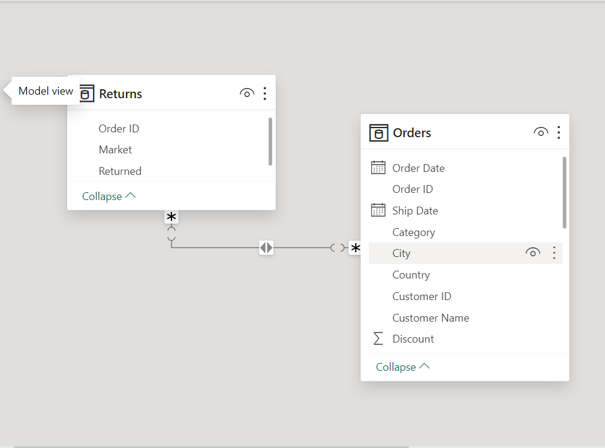

## ANALYSIS AND VISUALIZATION:
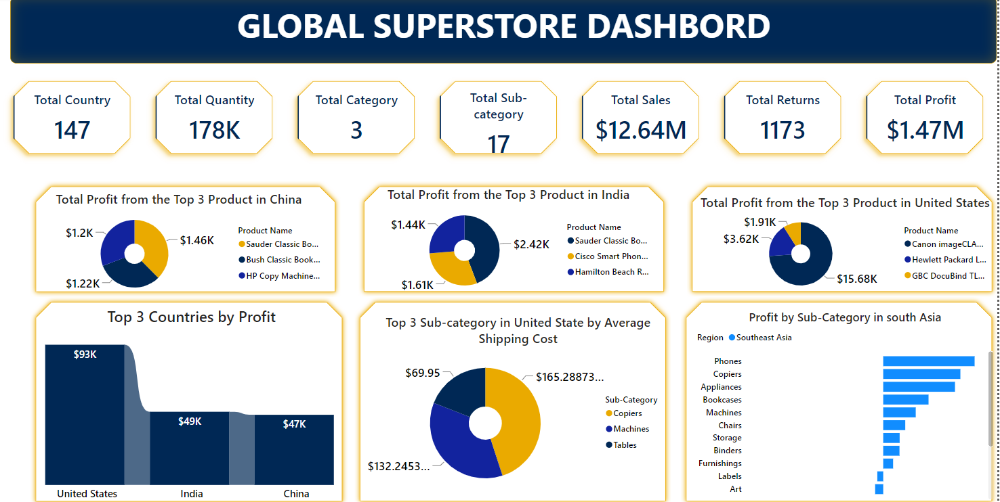
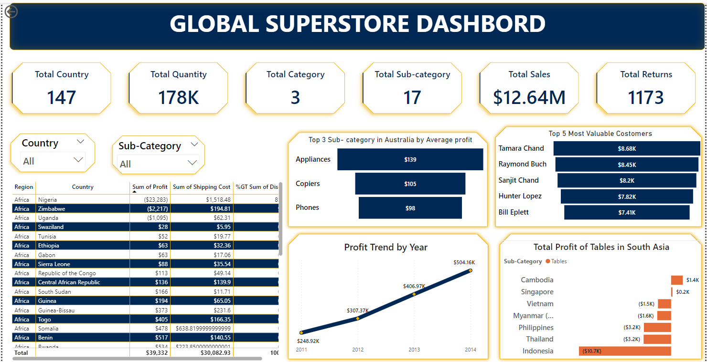
- The company demonstrated robust revenue generation, achieving an impressive total sales figure of $12.64 million.
- The business showcases adept cost management and operational efficiency, yielding a profit of $1.47 million.
- The substantial order quantity of 178K units highlights a strong demand and noteworthy transaction volume.
- The return of 1,173 units highlights a significant volume of products being returned, signaling a potential opportunity for enhancements in product quality or customer satisfaction.
- The existence of three distinct categories signifies a well-organized product classification system, which could contribute to effective inventory management and targeted marketing strategies.
- The inclusion of 17 sub-categories further refines the product range, enabling targeted marketing strategies and expanding the market reach.
- Spanning operations in 147 countries underscores a global presence, showcasing potential opportunities for international expansion and exposure to diverse markets.
***
Examining the store's profit trends over the years reveals a consistent growth pattern from 2011 to 2014. Starting at $248.92k in 2011, the profits have steadily increased each subsequent year, culminating in a noteworthy $504.16k in 2014. This trend not only indicates a positive trajectory but also highlights the store's ability to consistently boost profits over time.
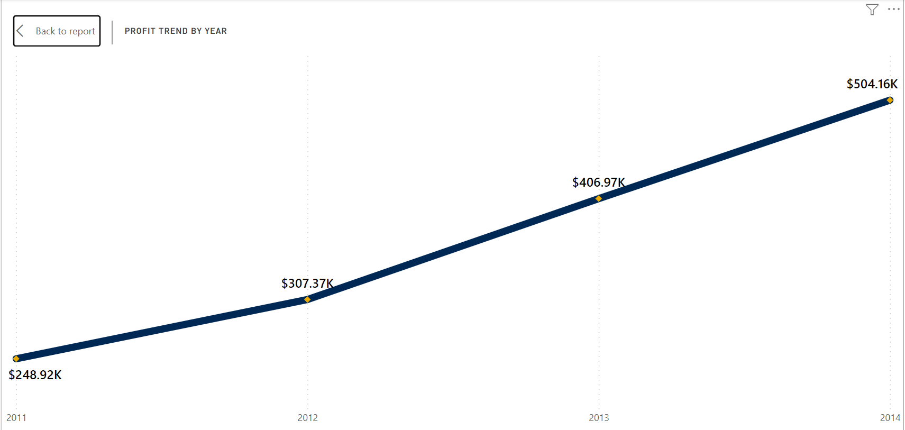
***
In 2014, the store generated profits of $504.16K from customers in 138 countries. The primary contributors to this total profit were the USA, contributing $93K, followed by India at $49K, and China with $47K. Together, these top three countries constituted almost 37.5% of the store's overall profits for the year.
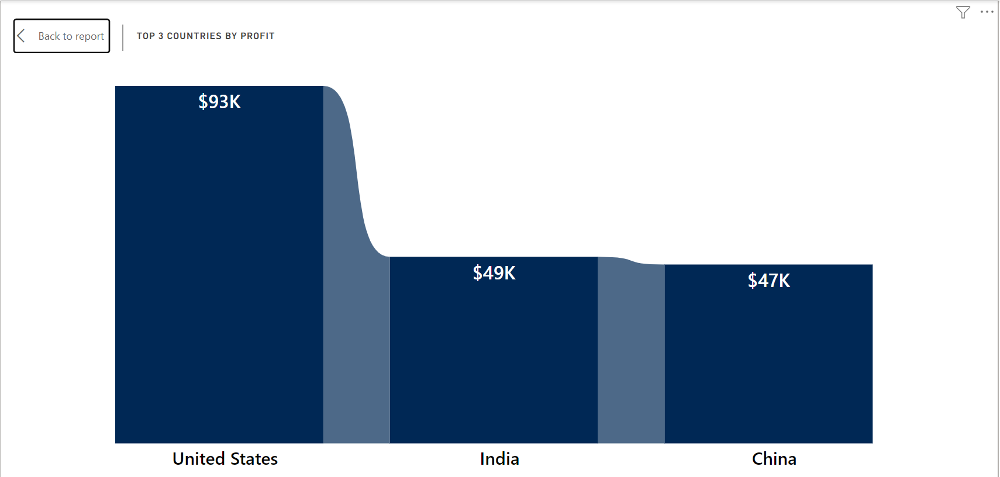
***

In 2014, the U.S. market featured three standout products that significantly contributed to overall profit:
-	The leading product was the Canon imageCLASS 2200 Advanced Copier, yielding a substantial profit of $15.68K, constituting approximately 16.8% of the total profit.
-	Following closely, the Hewlett-Packard LaserJet 3310 Copier secured the second position with profits totaling $3.62 K, making up roughly 3.9% of the overall profit.
-	The GBC DocuBind TL300 Electric Binding System captured the third spot, amassing profits of $1.91 K, representing about 2% of the total profit.
In aggregate, these top three products contributed to a commendable profit of $93.51 K in the USA market in 2014.
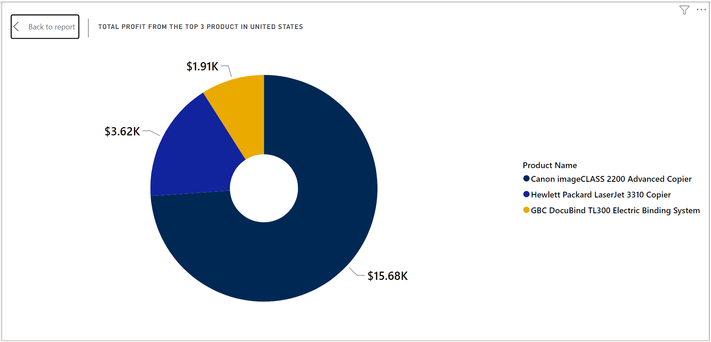
***

In India for the year 2014, the top three profit-generating products were as follows:
-	The Sauder Classic Bookcase, Traditional, led the pack with a total profit of $2.42K, constituting approximately 4.96% of the total profit.
-	The Cisco Smart Phone with Caller ID closely followed with a total profit of $1.61K, contributing about 3.30% to the overall profit.
-	Securing the third position, the Hamilton Beach Refrigerator in Red accumulated a total profit of $1.44K, making up approximately 2.95% of the total profit.
The combined profit for India in 2014 reached $48.81K.
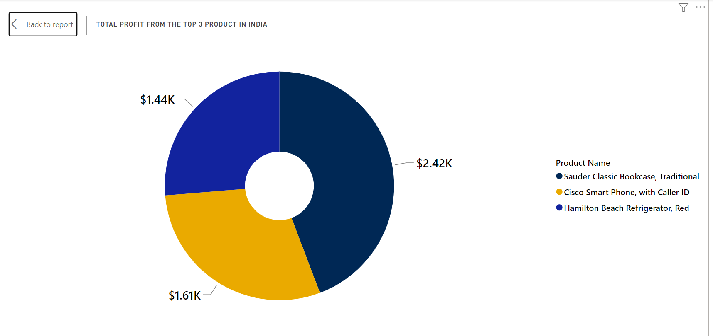
***

In 2014, the top three most lucrative products in China were as follows:
-	The Sauder Classic Bookcase, Metal, took the lead with a total profit of $1.46 K, contributing approximately 3.1% to China’s overall profit.
-	Following closely, the Bush Classic Bookcase, Mobile, secured the second position with a profit of $1.2 K, representing around 2.6% of the total profit.
-	The HP copy machine Digital, clinched the third spot with a profit of $1.2K, making up roughly 2.4% of the total profit.
In total, China's profit for the year 2014 amounted to $46.79K.
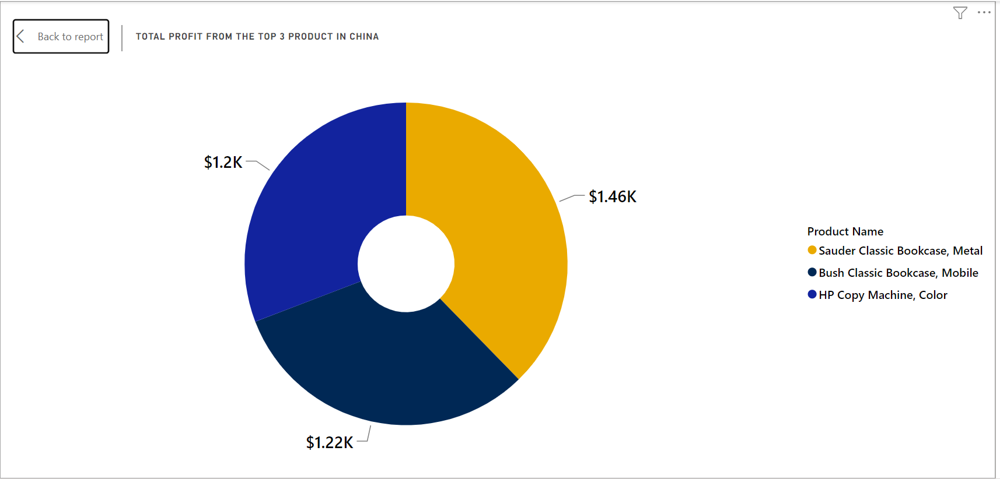
***

In the United States, the three leading sub-categories based on average shipping costs are as follows:
-	Copiers top the list with an average shipping cost of $165.29.
-	Machines closely follow in the second position, with an average shipping cost of $132.25.
-	Tables secure the third spot with an average shipping cost of $69.95.
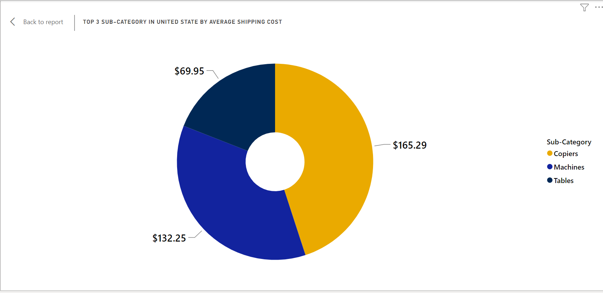
***

In 2014, African countries collectively generated a total profit of $39.33K. Among the 39 African nations, Nigeria reported the lowest profit, standing at -$23.29 K, placing it in the 39th position. In contrast, South Africa led with the highest profit of $9.36K, followed by Morocco at $8.44 K and Egypt at $6.49K.
South Africa's profit represents approximately 23.8% of the total African profit.
Morocco's profit accounts for about 21.5% of the total.
Egypt's profit contributes roughly 16.5% to the total African profit.
Nigeria's negative profit indicates a loss, representing about -59.2% of the total African profit.
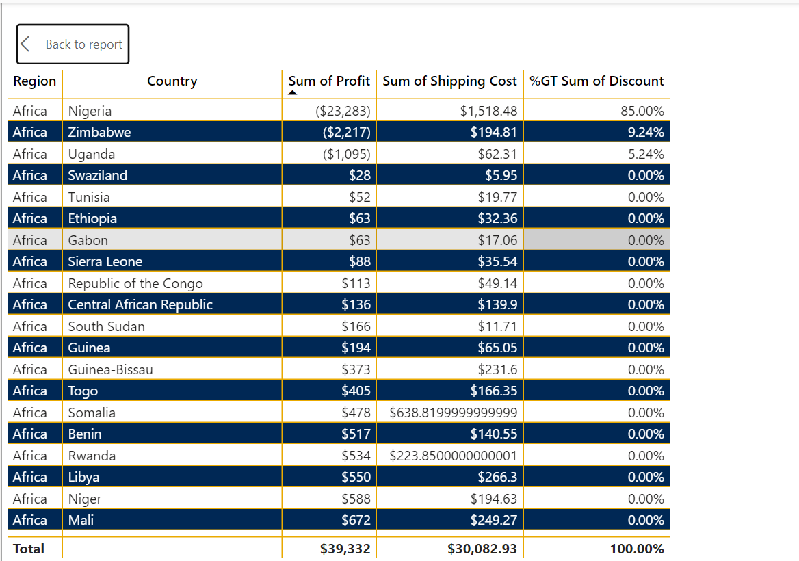
***

In Southeast Asia, the total profit generated amounts to $17.85K, constituting 1.21% of the store's overall profit across all regions. Within the 17 distinct sub-categories in the region, Tables emerged as the least profitable, reporting a loss of -$18.62K. Following closely, Accessories incurred a loss of -$8.64K, and Supplies reported a loss of -$4.03K.
The loss from Tables represents approximately -104.5% of the total profit in Southeast Asia.
Accessories contribute a negative 48.4% to the overall profit.
Supplies account for a negative 22.5% of the total profit in the region.
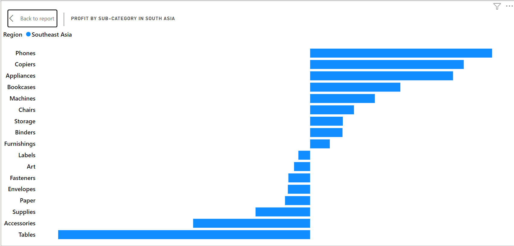
***

In Southeast Asia, the sales performance of Tables incurred a cumulative loss of -$18.62K across seven countries. Among these nations, Indonesia reported the lowest profit, with a loss of -$10.68K.
Indonesia's loss represents approximately -57.3% of the total profit loss for Tables in Southeast Asia.
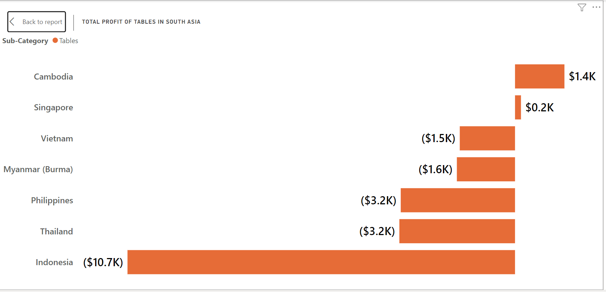
***

In Australia, among 17 sub-categories, Appliances distinguished itself by achieving the highest average profit of $139.01. This underscores the notable outperformance of Appliances compared to other sub-categories, such as Copiers and Phones, which reported profits of $105.06 and $98.32, respectively.
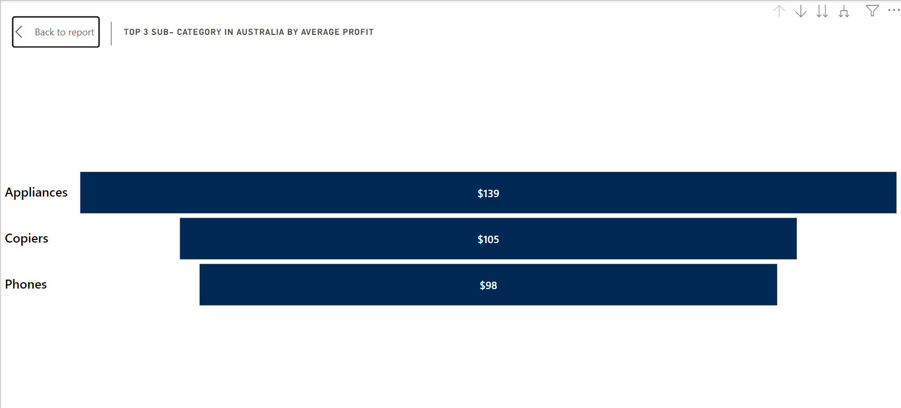
***

The collective profit from all customers amounts to $1.47 million across 1,590 customers. Among them, the top  most valuable customers based on both profit generated and products purchased are:
Tamara Chand, contributing $8.79K (0.6% of total profit).
Raymond Buch, with a profit of $8.52K (0.58% of total profit).
Sanjit Chand, generating $8.11K (0.55% of total profit).
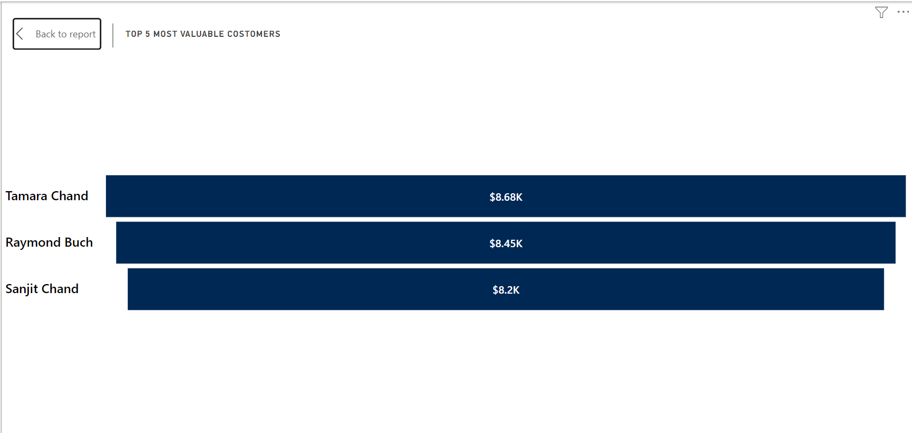

## CONCLUSTION AND RECOMMENDATION: 
- The primary factor contributing to Nigeria's subpar performance may stem from being the only African country (excluding Zimbabwe, Uganda, and Tanzania) where an overall percentage discount exceeding 80% was granted to customers who made purchases in 2014.
-	The overall shipping costs for delivering products to Nigeria are notably on the higher side.
-	Indonesia emerges as the least performing country in South Asia when considering the total profit from the sales of tables. It may be important for the Global Super Store to contemplate discontinuing the sales of tables in Indonesia.

